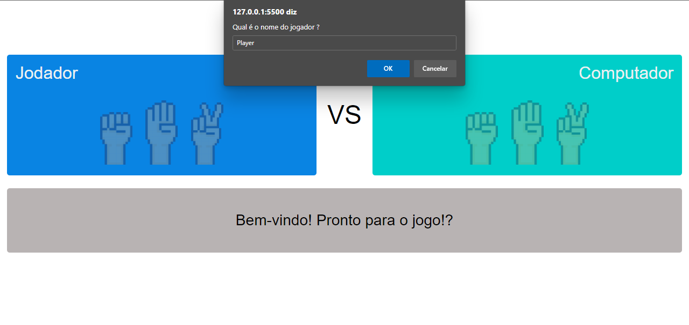
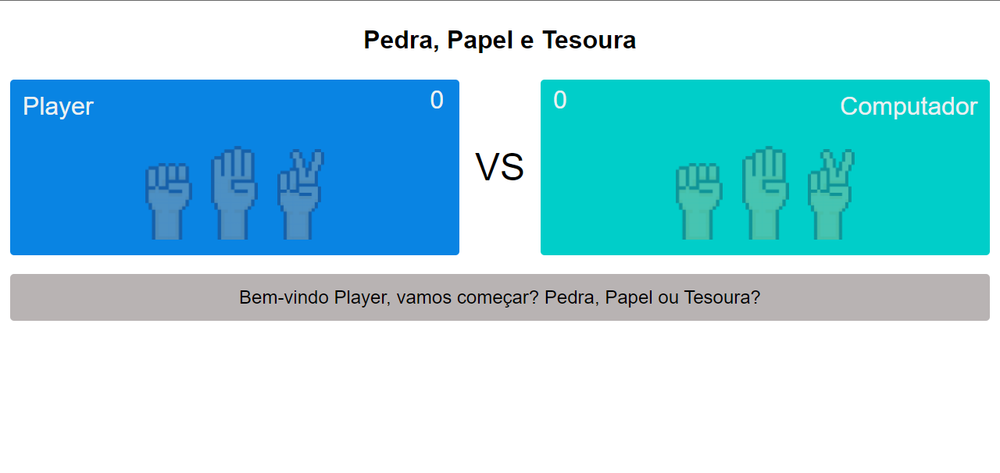
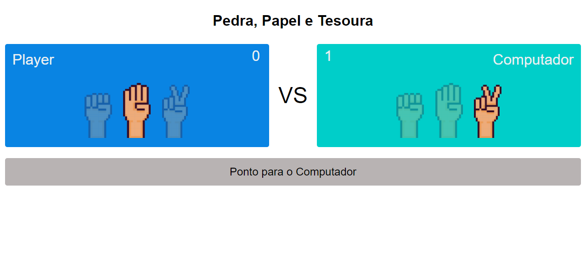
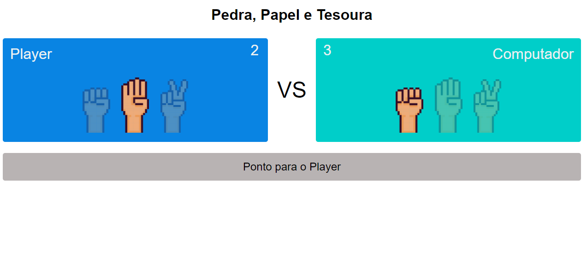
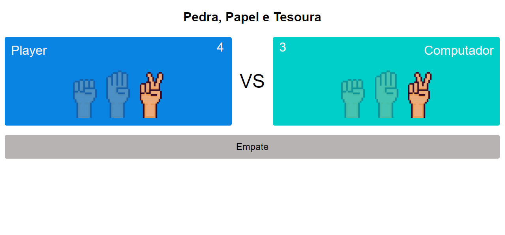

# Projeto Jogo Jokenpô

## Como usar? 

---
Basta fazer o download do diretorio "jokenpo" em qualquer diretório local e abrir o arquivo "index.html" em qualquer navegador moderno. 

Pronto, bom divertimento!

---
## Imagens do jogo!
---
---

**Primeira tela, informe o nome do jogador.**

---
---

**Tela de jogo, escolha uma opção, "Pedra, Papel ou Tesoura"**

---
---

**Ponto para o Computador**

---
---

**Ponto para o Jogador**

---
---

**Empate**
